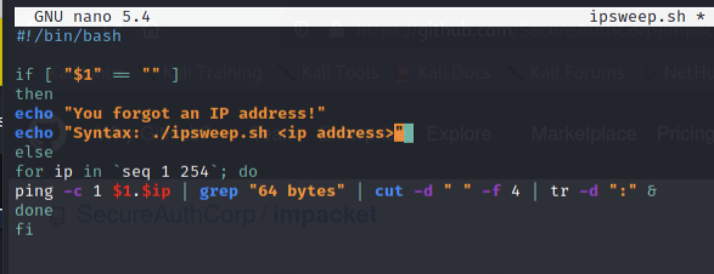

Bash Scripting 

**Ping sweep**

192.168.0.1

\- ping device and if device is alive, sweep

\- c : count

\- d : delimiter

\- f : field

\- tr : translate

1.  run ifconfig to identify alive devices
2.  run `ping <ip address> -c 1 > ip.txt : insert packet data into txt file`
3.  run `cat ip.txt | grep "64 bytes"`
4.  we want to ping every ip within the subnet
5.  run `cat ip.txt | grep "64 bytes" | cut -d " " -f 4 | tr -d ":"`
6.  Create script to ping subnet
7.  
8.  run `chmod  +x ipsweep.sh`
9.  run `./ipsweep.sh <ip address> > ips.txt` : create file and insert live ip addresses
10. run `cat ips.txt : print ip addresses`
11. run `for ip in $(cat ips.txt); do nmap $ip & done` : this will run an nmap report for each ip address