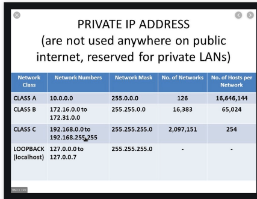

Networking 

**IP Addresses**
- ifconfig [linux/unix]
- ipconfig [windows]
    - Layer 3 protocols : Routers -> the layer we communicate with 
    	- inet -> ipv4
        	- 32 bit
        	- 32^2 = number of IP addresses
        	- public 
        	- what is sent out to the internet 
    	- inet6 -> ipv6
        	- hexidecimal : 128 bits 
        	- 2 ^ 128 = number of IP addresses

**NAT**
- Network Address Translation
	- IPV6 -> MAC address

Some routers are Layer 2 and Layer 3 which means they work as a switch and router. 

**MAC Address : Media Access Control : Layer 2 (switching)**
- physical address : how the computer communicates via switches 
- ether
- xx:xx:xx -> first three all all identifiers that allow you to lookup the the company that manufactured the nic [network interface card]
- you can perform a reverse look up via MAC address
	- arul's utilities
	- aruljohn.com/

**TCP/UDP - Layer 4 - Transport Layer** 
- TCP 
	- high reliablity 
	- stateful
	- Three way handshake 
		- SYN : Hey can I connect on 443
		- SYN/ACK  : If 443 is open sure! 
		- ACK : Cool I'm ready to talk let's connect on 443 
	- HTTP/HTTPs
	- SSH 
	- SFTP
- UDP : User Datagram Protocol
	- Connectionless 
	- stateless
	- VOIP
	- Streaming services 
	- DNS 

