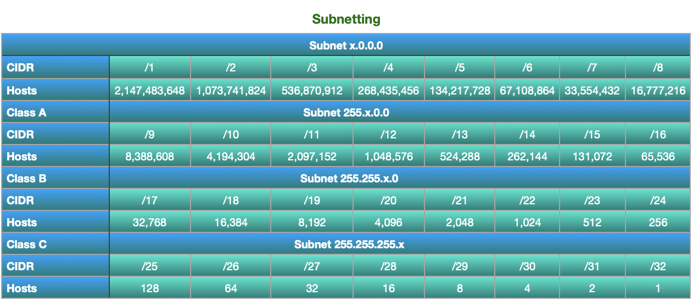
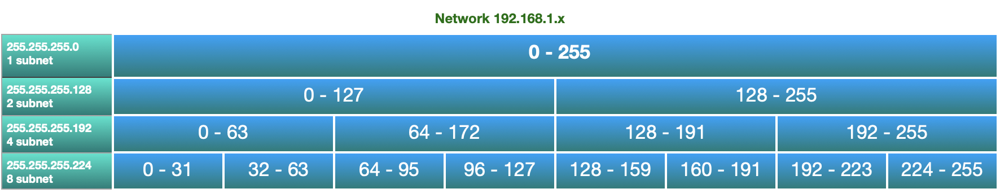
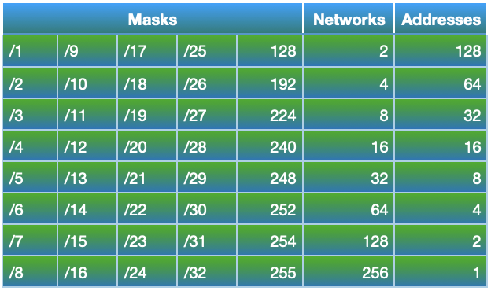

Subnetting

**Subnetting**

- 255.255.255.0/24 -> commonly called /24 Network
    - commonly used in households and small businesses
- The more switches you have on the less hosts your have available
- Network ID = First address
- Broadcast ID = Last address

**Switches**

- must be turned on in order

netmask = subnetmask

**Hosts**

- Host - 2  = number of possible  devices within a network

**Resources**

www.ipaddressguide.com/cidr

**Cyber Mentor Subnetting Cheat Sheet**

Notes :  *Hosts double each increment of a CIDR

*Always subtract 2 from host total:

Network ID - First Address

Broadcast - Last Address

**Professer Messer Seven Second Subnetting reference table**

[Professor Messer Seven Second Subnetting](https://www.youtube.com/watch?v=ZxAwQB8TZsM)

